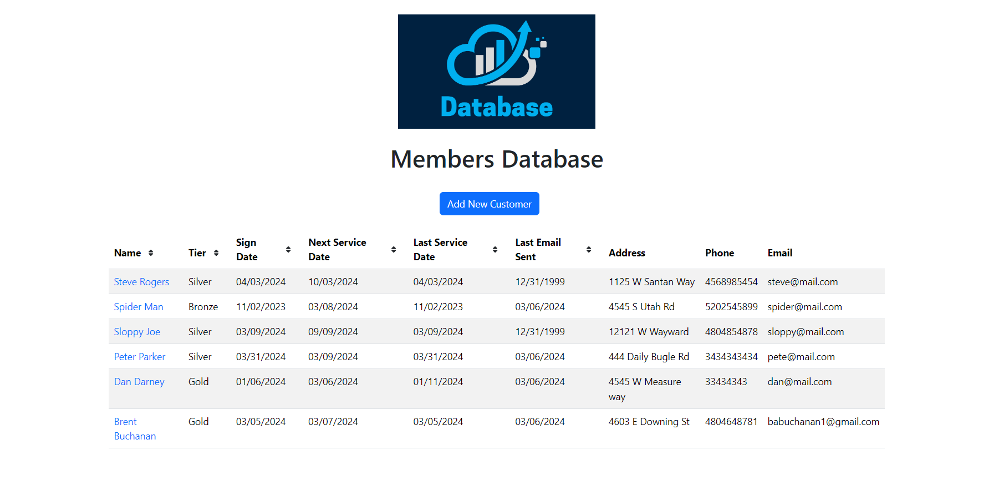
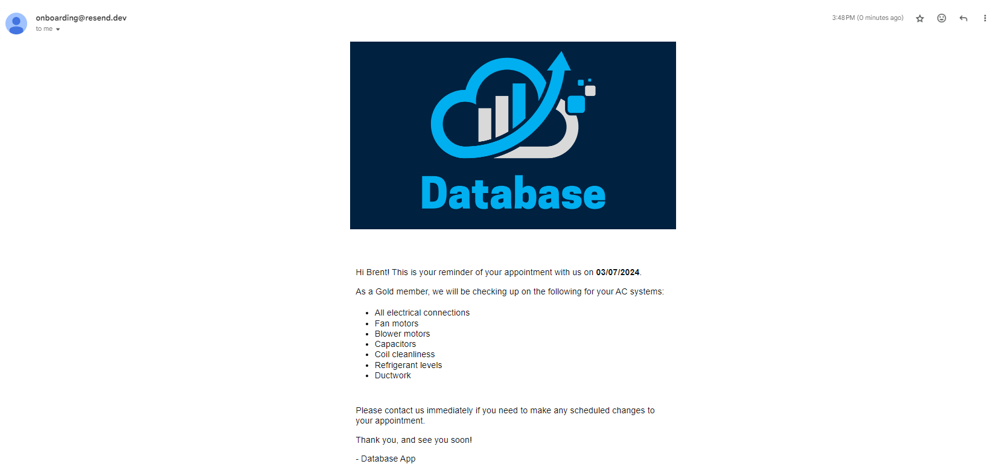
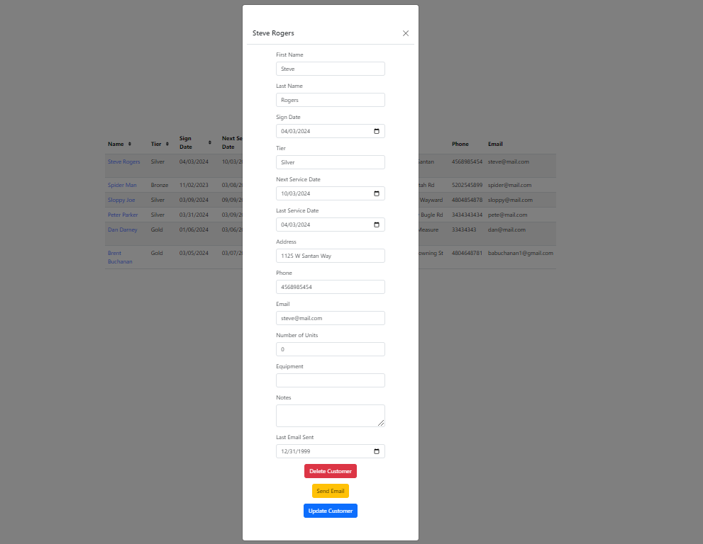
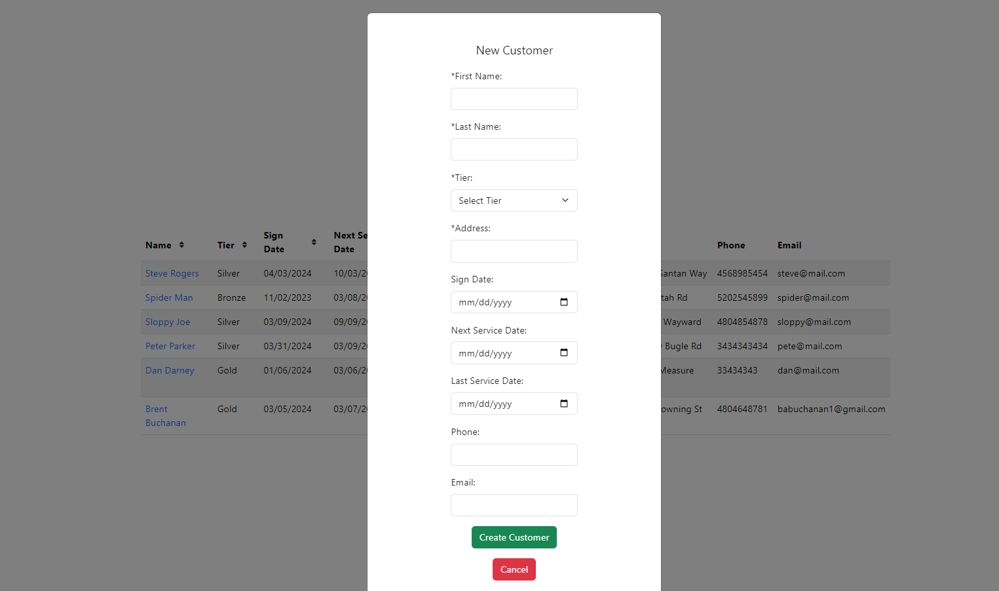

# Project Name

Database App

## Description

This is a database app that can be used for various businesses to keep track of their customers, especially subscription customers. This app allows you to send emails via Resend to your customers reminding them of appointments.

The server also uses `node-cron` to check for any upcoming appointments each day and automatically sends out email reminders for those customers.

Database is also quickly filterable in ascending or descending order for 6 different data fields. The basic CRUD actions are also enabled for each table entry.

## Installation

1. Clone the repo
2. Install npm packages on both the root level and the client folder
3. Create environment variables for the MYSQL database
4. Create a MYSQL database for this project
5. Run the server and client

## Usage

Use for any business that wants to keep track of their customers automatically.

## Screenshots

